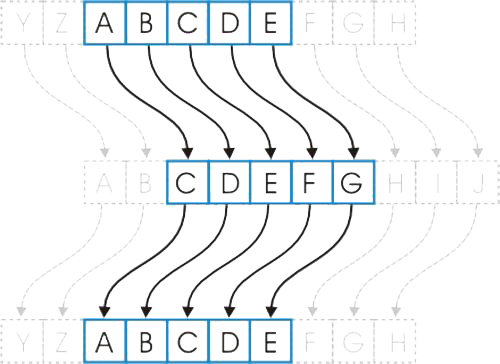

# Cifrado César

*cursiva*  
**negrita**  
Para agregar un link [lo que quiero que diga y me lleva a la pagina al pincharlo](https://fonts.google.com/)

Para agregar imagenes (hacer carpeta de imagen y seguir la ruta en el proyecto, si es de internet colocar la url ) /codigo.jp(nombre de la imagen))    

Cifrar significa codificar. El [cifrado César](https://en.wikipedia.org/wiki/Caesar_cipher) es uno de los primeros métodos de cifrado conocidos. El emperador romano Julio César lo usaba para enviar órdenes secretas a sus generales en los campos de batalla.

El cifrado césar es una de las técnicas más simples para cifrar un mensaje. Es un tipo de cifrado por sustitución, es decir que cada letra del texto original es reemplazada por otra que se encuentra un número fijo de posiciones (desplazamiento) más adelante en el mismo alfabeto.

Por ejemplo, si usamos un desplazamiento (_offset_) de 3 posiciones:

- La letra A se cifra como D.
- La palabra CASA se cifra como FDVD.
- Alfabeto sin cifrar: A B C D E F G H I J K L M N O P Q R S T U V W X Y Z
- Alfabeto cifrado: D E F G H I J K L M N O P Q R S T U V W X Y Z A B C

En la actualidad, todos los cifrados de sustitución simple se descifran con mucha facilidad y, aunque en la práctica no ofrecen mucha seguridad en la comunicación por sí mismos; el cifrado César sí puede formar parte de sistemas más complejos de codificación, como el cifrado Vigenère, e incluso tiene aplicación en el sistema ROT13.

## Resumen del proyecto

Aplicación web destinada para novios. Entrega el servicio al usuario de cifrar y descifrar el texto que quiere redactar en su parte de matrimonio, indicando un desplazamiento específico de caracteres (_offset_).

## Objetivos de aprendizaje

- Verificar tu implementación con **pruebas unitarias**.
- Entender las **necesidades del usuario** y cómo proponer una solución.
- Organizar tu tiempo y priorizar tareas en un entorno de **alta incertidumbre**.

#### Definición del producto

En el README.md, cuéntanos cómo pensaste en los usuarios y cuál fue tu proceso para definir el producto final a nivel de experiencia y de interfaz.

La aplicación web se puede utilizar desde cualquier computador con tan solo ingresar al link correspondiente.
Una vez en el sitio puedes conseguir codificar el texto que necesites mediante el ingreso de este en el cuadro (*Ingresa tu texto aquí* ), luego debe ingresar el número correspondiente al mes de la boda (1 al 12) y presionar el botón **Cifrar**, si por el contrario lo que necesitas es descifrar debes ingresar el texto en el cuadro (*Ingresa tu texto aquí* ) luego debe ingresar el número correspondiente al mes de la boda (1 al 12) y presionar el botón **Descifrar**. En el cuadro de **Resultado** se entregará el el texto codificado o decodificado según corresponda.

#### Quiénes son los principales usuarios de producto.

Novios que estén en proceso de redactar sus partes de matrimonio y quieran entregar un toque distinto a sus invitaciones.

#### Cuáles son los objetivos de estos usuarios en relación con tu producto.
- Poder entregar una invitación distinta y llamativa a sus invitados.
- Poder reflejar lo que son como pareja, como es su personalidad y que estilo de matrimonio será (campestre, urbano, etc.)

#### Cómo crees que el producto que estás creando está resolviendo sus problemas.
- Al utilizar el cifrado cesar podrán tener un producto personalizado, con un toque de misterio que refleje la celebración que están planificando.

## Recursos y temas relacionados

Diseño de experiencia de usuario (User Experience Design):

- Ideación
- Prototipado (sketching)
- Testeo e Iteración

Desarrollo Front-end:

* [Valores](https://lms.laboratoria.la/cohorts/scl-2019-03-bc-core-common-core-scl009/courses/javascript/01-basics/01-values-variables-and-types)
* [Tipos](https://lms.laboratoria.la/cohorts/scl-2019-03-bc-core-common-core-scl009/courses/javascript/01-basics/01-values-variables-and-types)
* [Variables](https://lms.laboratoria.la/cohorts/scl-2019-03-bc-core-common-core-scl009/courses/javascript/01-basics/02-variables)
* [Control de flujo](https://lms.laboratoria.la/cohorts/scl-2019-03-bc-core-common-core-scl009/courses/javascript/02-flow-control/00-opening)
* [Tests unitarios](https://lms.laboratoria.la/cohorts/scl-2019-03-bc-core-common-core-scl009/courses/javascript/11-testing/00-opening)
* [Aprende más sobre `charCodeAt()`](https://developer.mozilla.org/es/docs/Web/JavaScript/Referencia/Objetos_globales/String/charCodeAt)
* [Aprende más sobre `String.fromCharCode()`](https://developer.mozilla.org/es/docs/Web/JavaScript/Referencia/Objetos_globales/String/fromCharCode)
* [Aprende más sobre `ASCII`](http://conceptodefinicion.de/ascii/)
* [Documentación de NPM](https://docs.npmjs.com/)

Herramientas:
- [GitHub y GitHub Pages](https://guides.github.com/)
- [Guía de Scrum](https://www.scrumguides.org/docs/scrumguide/v1/scrum-guide-es.pdf): solamente para comenzar a entender cómo organizar tu trabajo.

## Checklist
Esta sección está  para ayudarte a llevar un control de lo que vas completando.

### Parte Obligatoria
* [ ] `README.md` incluye info sobre proceso y decisiones de diseño.
* [ ] `README.md` explica claramente quiénes son los usuarios y su relación con
  el producto.
* [ ] `README.md` explica claramente cómo el producto soluciona los
  problemas/necesidades de los usuarios.
* [ ] Usa VanillaJS.
* [ ] No utiliza `this`.
* [ ] Implementa `cipher.encode`.
* [ ] Implementa `cipher.decode`.
* [ ] Pasa linter con configuración provista.
* [ ] Pasa pruebas unitarias.
* [ ] Pruebas unitarias cubren 70% de _statements_, _functions_ y _lines_, y un
  mínimo del 50% de _branches_.
* [ ] Interfaz permite elegir el `offset` o _desplazamiento_ a usar en el
  cifrado/descifrado.
* [ ] Interfaz permite escribir un texto para ser cifrado.
* [ ] Interfaz muestra el resultado del cifrado correctamente.
* [ ] Interfaz permite escribir un texto para ser descifrado.
* [ ] Interfaz muestra el resultado del descifrado correctamente.

